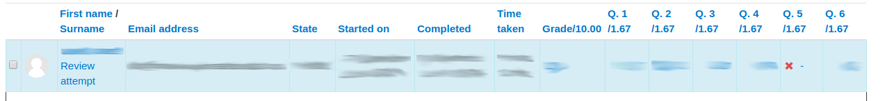
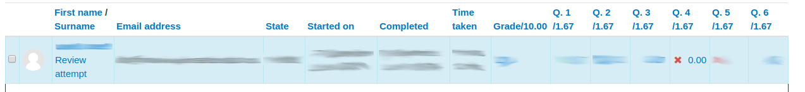
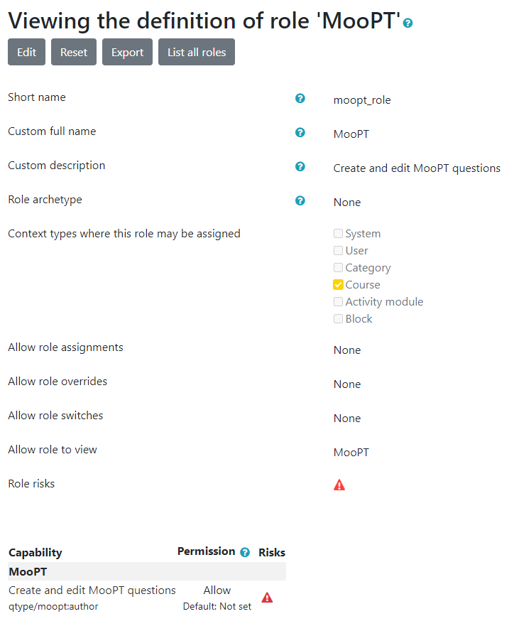

# Installation #

After downloading the plugin to the folder `moodle/question/type/` you need to rename the plugin folder itself to `moopt`.
Example: If you used `git clone` to clone the repository you probably have the following hierarchy: `moodle/question/type/moodle-qtype_moopt/`. Rename this to `moodle/question/type/moopt/`.

# Programmieraufgabe #


The attempt overview for the teacher is partly wrong for programming tasks, because mod_quiz isn't intended to be used with asynchronously graded questions. This results in a mismatch between the actual question state and the question state that is display to the user. The main problem is that in moodle there is no such state as "the student has submitted the answer, the question is therefore answered and finished but not yet graded". Some existing states do almost match on this but not entirely. This results in a display problem that is explained in the following:
*  
See question 5: The submission has been sent to the grader for grading but there is no result yet
*  
See question 4: Either there was a submission and it has been graded with 0.0 or there wasn't a submission in the first place
* 
Regrading has two problems: 
  1. The value in the column "Regrade" ("Done") is wrong. The submissions have been sent to the grader for regrading therefore the regrading process is finished from moodles point of view although in fact it is not.
  2. moodle will always display "[old value]/0.0" for each questions score. This could either mean that the grade process hasn't finished yet or that it did finish and the question has been graded with 0.0. Once the grade process finishes the score will be updated correctly. If, however, the graded score is indeed 0.0 the teacher will never know if the grade process has already finished or not (at least from the overview). 

# MooPT specific meta data in a ProFormA task #

The MooPT plugin recognizes a XML element `lms-input-fields` below `task/meta-data`. The file `res/proforma/xsd/urn_proforma_lmsinputfields_vN.M.xsd` declares the format of this MooPT specific extension of the ProFormA format.

The child elements control the widgets of the question creation dialog, that define whether students should submit files or textfield inputs. The meta data can define a file upload as well as several text fields. For both it is possible to specify one of the following programming languages:

```
'txt' => 'Plain text'
'java' => 'Java'
'sql' => 'SQL'
'cpp' => 'C/C++'
'javascript' => 'Javascript'
'php' => 'PHP'
'py' => 'Python'
'cs' => 'C#'
'scala' => 'Scala'
'bat' => 'Batchfile'
'css' => 'CSS'
'dart' => 'Dart'
'glsl' => 'GLSL'
'go' => 'Go'
'html' => 'HTML'
'json' => 'JSON'
'kt' => 'Kotlin'
'latex' => 'LaTeX'
'lua' => 'Lua'
'matlab' => 'MATLAB'
'mm' => 'Objective-C'
'pas' => 'Pascal'
'pl' => 'Perl'
'prolog' => 'Prolog'
'r' => 'R'
'rb' => 'Ruby'
'rs' => 'Rust'
'swift' => 'Swift'
'typescript' => 'Typescript'
'xml' => 'XML'
'yaml' => 'YAML'
```

# MooPT specific capability #

The MooPT plugin defines a Moodle capability to create and edit MooPT questions. By default, the roles *manager* and *editingteacher* will get that capability. If access to authorship of questions of the MooPT question type should be restricted to selected users in selected courses, after installation of MooPT you should withdraw the capability `qtype/moopt:author` for *editingteacher*s and selectively assign it to users in courses. As a Moodle site administrator it might be helpful to create a blank new Moodle role *MooPT* that is not based on an existing role archetype. Then you should allow the capability `qtype/moopt:author` for the new role. The following screenshot shows a sample configuration of the new role:

 

As a Moodle site administrator then the new *MooPT* role can be assigned to selected users in selected courses via the Moodle *Manage courses and categories* dialogue.


## License ##

2019 ZLB-ELC Hochschule Hannover <elc@hs-hannover.de>

This program is free software: you can redistribute it and/or modify it under
the terms of the GNU General Public License as published by the Free Software
Foundation, either version 3 of the License, or (at your option) any later
version.

This program is distributed in the hope that it will be useful, but WITHOUT ANY
WARRANTY; without even the implied warranty of MERCHANTABILITY or FITNESS FOR A
PARTICULAR PURPOSE.  See the GNU General Public License for more details.

You should have received a copy of the GNU General Public License along with
this program.  If not, see <http://www.gnu.org/licenses/>.
